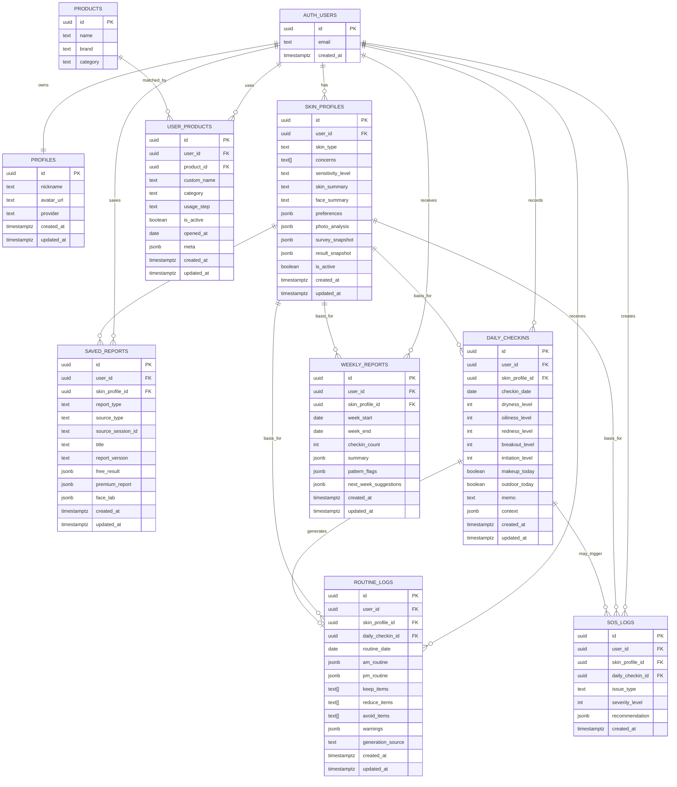

# 비주얼리 재방문 구조 DB ERD

> Version: v0.2  
> Updated: profiles 생성 전략, active skin_profile partial unique index, report_version, local date 규칙, routine_logs derived cache 정책, weekly report lazy generation 원칙을 보강했다.

## 1. 문서 목적

이 문서는 비주얼리의 재방문 구조를 구현하기 위한 DB ERD 정의서다.

대상 기능:

- 소셜 로그인 사용자 관리
- 진단 결과 저장
- 내 피부 프로필 관리
- 오늘 피부 체크
- 오늘 루틴 카드
- 내 현재 제품 관리
- 제품 조합 점검
- 피부 SOS
- 주간 피부 리포트
- 기존 무료/유료 결과 저장 구조와의 연결

Codex는 이 문서를 기준으로 Supabase PostgreSQL 마이그레이션, RLS 정책, API route, UI 데이터 조회 구조를 단계적으로 구현한다.

---

## 2. 설계 방향

## 2.1 핵심 원칙

```txt
1. Supabase Auth의 auth.users를 사용자 원본으로 사용한다.
2. public.profiles는 auth.users의 확장 프로필 테이블로 사용한다.
3. 사용자의 피부 진단 결과는 skin_profiles에 저장한다.
4. 매일 체크인 기록은 daily_checkins에 저장한다.
5. 체크인 기반 루틴 결과는 routine_logs에 저장한다.
6. 현재 사용 제품은 user_products에 저장한다.
7. SOS 기록은 sos_logs에 저장한다.
8. 주간 요약은 weekly_reports에 저장한다.
9. 기존 products 테이블은 그대로 재사용한다.
10. 기존 premium_report_sessions는 무리하게 제거하지 않고 saved_reports와 연결한다.
```

---

## 2.2 기존 구조 보존 원칙

현재 비주얼리에는 이미 아래 흐름이 존재한다.

```txt
/onboarding
/result
/result/full-report
/api/analyze
/api/full-report
premium_report_sessions
products
공유 결과 관련 구조
```

새 DB 구조는 기존 결과/공유/프리미엄 기능을 깨지 않고 확장해야 한다.

권장 방향:

```txt
기존 결과 생성 flow 유지
→ 로그인 저장 기능 추가
→ 저장 시 skin_profiles / saved_reports에 복사
→ 로그인 홈은 저장된 데이터를 읽음
```

---

## 2.3 MVP 저장 전략

초기에는 모든 것을 과도하게 정규화하지 않는다.

권장 방식:

```txt
자주 검색/집계하는 값 = 컬럼
원본 결과/루틴 상세 = jsonb
```

예:

```txt
skin_type, concerns, sensitivity_level = 컬럼
full report 원문, 루틴 상세, Face Lab 상세 = jsonb
```

---

# 3. 전체 ERD



---

# 4. 테이블 상세

---

## 4.1 `auth.users`

Supabase Auth가 관리하는 사용자 원본 테이블이다.

직접 수정하지 않는다.

참조 원칙:

```txt
public 테이블의 user_id는 auth.users(id)를 참조한다.
```

---

## 4.2 `profiles`

사용자의 기본 프로필 테이블이다.

### 목적

- auth.users의 확장 테이블
- 앱에서 노출할 사용자 정보 저장
- 닉네임, 프로필 이미지, 로그인 provider 저장

### 컬럼

| 컬럼 | 타입 | 필수 | 설명 |
|---|---:|---:|---|
| id | uuid | Y | auth.users(id) 참조. PK |
| nickname | text | N | 사용자 표시명 |
| avatar_url | text | N | 소셜 프로필 이미지 |
| provider | text | N | kakao, google 등 |
| created_at | timestamptz | Y | 생성일 |
| updated_at | timestamptz | Y | 수정일 |

### 관계

```txt
profiles.id → auth.users.id
```

### 제약

```sql
primary key (id)
foreign key (id) references auth.users(id) on delete cascade
```


### profiles 생성 전략

OAuth 로그인 성공 후 `auth.users`에는 사용자가 생성되지만, `public.profiles` row는 자동으로 생기지 않을 수 있다.

MVP 권장 방식:

```txt
/auth/callback/route.js에서 현재 user 정보를 읽고 profiles를 upsert한다.
```

권장 이유:

```txt
Supabase trigger 기반 자동 생성보다 Next route에서 명시적으로 upsert하는 방식이 초기 디버깅에 유리하다.
```

upsert 기준:

```txt
id = auth.users.id
nickname = user_metadata.name 또는 user_metadata.full_name
avatar_url = user_metadata.avatar_url
provider = app_metadata.provider 또는 identities[0].provider
```

주의:

```txt
profiles가 없어도 로그인 자체는 성공할 수 있다.
따라서 /my 진입 전에 profiles upsert를 보장하거나, /my dashboard API에서 보정 upsert를 수행한다.
```

---

## 4.3 `skin_profiles`

사용자의 피부 진단 결과를 저장하는 핵심 테이블이다.

### 목적

- 최초 진단 결과 저장
- 로그인 홈의 기본 프로필 소스
- daily_checkins, routine_logs, sos_logs, weekly_reports의 기준 데이터
- 최신 피부 상태와 진단 스냅샷 보관

### 컬럼

| 컬럼 | 타입 | 필수 | 설명 |
|---|---:|---:|---|
| id | uuid | Y | PK |
| user_id | uuid | Y | auth.users(id) 참조 |
| skin_type | text | N | dry, oily, combination, sensitive 등 |
| concerns | text[] | N | acne, redness, pores 등 |
| sensitivity_level | text | N | low, medium, high |
| skin_summary | text | N | 피부 분석 요약 |
| face_summary | text | N | Face Lab 요약 |
| preferences | jsonb | N | 선호 사용감, 백탁, 눈시림 등 |
| photo_analysis | jsonb | N | 사진 분석 원본/요약 |
| survey_snapshot | jsonb | N | 설문 응답 스냅샷 |
| result_snapshot | jsonb | N | 무료 결과 전체 스냅샷 |
| is_active | boolean | Y | 현재 대표 프로필 여부 |
| created_at | timestamptz | Y | 생성일 |
| updated_at | timestamptz | Y | 수정일 |

### 권장 기본값

```sql
id default gen_random_uuid()
is_active default true
created_at default now()
updated_at default now()
```

### 인덱스

```sql
create index idx_skin_profiles_user_id_created_at
on public.skin_profiles (user_id, created_at desc);

create index idx_skin_profiles_user_id_active
on public.skin_profiles (user_id, is_active);

create unique index idx_skin_profiles_single_active
on public.skin_profiles (user_id)
where is_active = true;
```

### 운영 규칙

- 사용자가 새 진단을 저장하면 새 row를 만든다.
- 최신 row를 `is_active = true`로 둔다.
- 같은 사용자의 기존 active profile은 false로 변경한다.
- DB 차원에서 사용자당 active profile은 1개만 허용한다.
- 이를 위해 `where is_active = true` partial unique index를 사용한다.
- 과거 진단 기록은 삭제하지 않는다.

---

## 4.4 `saved_reports`

무료/유료 리포트 저장 테이블이다.

### 목적

- 무료 결과 저장
- 유료 Full Report 저장
- 기존 premium_report_sessions와 로그인 계정 연결
- 사용자가 과거 리포트를 다시 볼 수 있게 함

### 컬럼

| 컬럼 | 타입 | 필수 | 설명 |
|---|---:|---:|---|
| id | uuid | Y | PK |
| user_id | uuid | Y | auth.users(id) 참조 |
| skin_profile_id | uuid | N | skin_profiles(id) 참조 |
| report_type | text | Y | free, premium |
| source_type | text | N | session, premium_report_session, share, manual |
| source_session_id | text | N | 기존 sid 또는 share id |
| title | text | N | 리포트 표시 제목 |
| report_version | text | N | 결과/프롬프트/렌더링 버전 |
| free_result | jsonb | N | 무료 결과 JSON |
| premium_report | jsonb | N | 유료 리포트 JSON |
| face_lab | jsonb | N | Face Lab JSON |
| created_at | timestamptz | Y | 생성일 |
| updated_at | timestamptz | Y | 수정일 |

### report_type 허용값

```txt
free
premium
```

### source_type 허용값

```txt
session
premium_report_session
share
manual
```


### report_version 운영 규칙

`free_result`, `premium_report`, `face_lab`은 JSONB로 저장되므로 시간이 지나면서 결과 shape가 바뀔 수 있다.

`report_version`은 아래 용도로 사용한다.

```txt
- 예전 리포트 렌더링 호환
- 프롬프트 버전 구분
- 결과 JSON 구조 변경 추적
- 향후 report migration 판단
```

예시:

```txt
free-v1
premium-v1
face-lab-v1
2026-05-report-v1
```

### 인덱스

```sql
create index idx_saved_reports_user_id_created_at
on public.saved_reports (user_id, created_at desc);

create index idx_saved_reports_skin_profile_id
on public.saved_reports (skin_profile_id);
```

### 운영 규칙

- 무료 결과 저장 시 `report_type = 'free'`
- 유료 결과 저장 시 `report_type = 'premium'`
- 기존 `premium_report_sessions`를 바로 없애지 않는다.
- 로그인 저장 시 `premium_report_sessions.sid` 또는 기존 세션 id를 `source_session_id`에 남긴다.

---

## 4.5 `daily_checkins`

사용자의 오늘 피부 상태 기록 테이블이다.

### 목적

- 매일 또는 필요시 피부 상태 기록
- 오늘 루틴 카드 생성 기준
- 주간 리포트 집계 기준

### 컬럼

| 컬럼 | 타입 | 필수 | 설명 |
|---|---:|---:|---|
| id | uuid | Y | PK |
| user_id | uuid | Y | auth.users(id) 참조 |
| skin_profile_id | uuid | N | 기준 skin_profile |
| checkin_date | date | Y | 체크인 날짜 |
| dryness_level | int | Y | 당김/건조 정도. 0~4 |
| oiliness_level | int | Y | 유분 정도. 0~4 |
| redness_level | int | Y | 붉은기 정도. 0~4 |
| breakout_level | int | Y | 트러블 정도. 0~4 |
| irritation_level | int | Y | 자극감 정도. 0~4 |
| makeup_today | boolean | Y | 화장 예정 여부 |
| outdoor_today | boolean | Y | 야외 활동 여부 |
| memo | text | N | 사용자 메모 |
| context | jsonb | N | 확장 정보. 날씨, 수면, 스트레스 등 |
| created_at | timestamptz | Y | 생성일 |
| updated_at | timestamptz | Y | 수정일 |

### 레벨 규칙

```txt
0 = 없음
1 = 약함
2 = 보통
3 = 강함
4 = 매우 강함
```


### checkin_date 운영 규칙

`checkin_date`는 서버 UTC 기준이 아니라 **사용자 로컬 날짜 기준**으로 저장한다.

MVP 권장:

```txt
클라이언트에서 사용자의 local date를 YYYY-MM-DD 형식으로 계산해 서버에 전송한다.
서버의 default current_date는 fallback으로만 사용한다.
```

이유:

```txt
Supabase/PostgreSQL 서버 timezone과 한국 사용자 날짜가 어긋나면,
새벽 시간대에 하루 체크인이 잘못 묶일 수 있다.
```

### 제약

```sql
check (dryness_level between 0 and 4)
check (oiliness_level between 0 and 4)
check (redness_level between 0 and 4)
check (breakout_level between 0 and 4)
check (irritation_level between 0 and 4)
unique (user_id, checkin_date)
```

### 인덱스

```sql
create index idx_daily_checkins_user_id_date
on public.daily_checkins (user_id, checkin_date desc);
```

### 운영 규칙

- MVP에서는 하루 1개 체크인을 기본으로 한다.
- 같은 날짜에 다시 제출하면 insert가 아니라 update/upsert한다.
- 나중에 하루 여러 번 기록이 필요하면 `checkin_time` 또는 `sequence`를 추가한다.

---

## 4.6 `routine_logs`

체크인 기반으로 생성된 오늘 루틴 카드 저장 테이블이다.

### 목적

- 오늘 AM/PM 루틴 저장
- 오늘 피해야 할 조합 저장
- `/my` 홈에서 루틴 카드 재조회
- 새로고침/재방문 시 결과 유지


### 성격

`routine_logs`는 원본 데이터가 아니라, `skin_profiles + daily_checkins` 기반으로 생성된 **derived cache** 성격의 데이터다.

운영 원칙:

```txt
- 필요하면 regenerate 가능하다.
- 같은 날짜의 체크인이 수정되면 overwrite/update 가능하다.
- generation_source로 rule / llm / hybrid 출처를 구분한다.
- 사용자는 최종 루틴 카드를 안정적으로 다시 볼 수 있어야 한다.
```

### 컬럼

| 컬럼 | 타입 | 필수 | 설명 |
|---|---:|---:|---|
| id | uuid | Y | PK |
| user_id | uuid | Y | auth.users(id) 참조 |
| skin_profile_id | uuid | N | 기준 skin_profile |
| daily_checkin_id | uuid | N | 기준 daily_checkin |
| routine_date | date | Y | 루틴 날짜 |
| am_routine | jsonb | N | 아침 루틴 |
| pm_routine | jsonb | N | 저녁 루틴 |
| keep_items | text[] | N | 오늘 유지할 것 |
| reduce_items | text[] | N | 오늘 줄일 것 |
| avoid_items | text[] | N | 오늘 피할 것 |
| warnings | jsonb | N | 위험 조합/주의 문구 |
| generation_source | text | Y | rule, llm, hybrid |
| created_at | timestamptz | Y | 생성일 |
| updated_at | timestamptz | Y | 수정일 |

### generation_source 허용값

```txt
rule
llm
hybrid
```

### 제약

```sql
unique (user_id, routine_date)
```

### 인덱스

```sql
create index idx_routine_logs_user_id_date
on public.routine_logs (user_id, routine_date desc);

create index idx_routine_logs_daily_checkin_id
on public.routine_logs (daily_checkin_id);
```

### 운영 규칙

- MVP에서는 rule 기반으로 생성한다.
- 문장 다듬기가 필요할 때만 LLM을 사용한다.
- 체크인이 수정되면 routine_log도 update한다.

---

## 4.7 `user_products`

사용자가 현재 사용 중인 제품을 저장하는 테이블이다.

### 목적

- 내 화장대/내 루틴 제품 관리
- 기존 products 테이블과 연결
- DB에 없는 제품은 직접 입력으로 저장
- 제품 조합 점검 기준

### 컬럼

| 컬럼 | 타입 | 필수 | 설명 |
|---|---:|---:|---|
| id | uuid | Y | PK |
| user_id | uuid | Y | auth.users(id) 참조 |
| product_id | uuid | N | products(id) 참조 |
| custom_name | text | N | 직접 입력 제품명 |
| category | text | Y | cleanser, toner_pad 등 |
| usage_step | text | N | morning, night, both |
| is_active | boolean | Y | 현재 사용 중 여부 |
| opened_at | date | N | 개봉일 |
| meta | jsonb | N | 메모, 빈도, 부작용 기록 등 |
| created_at | timestamptz | Y | 생성일 |
| updated_at | timestamptz | Y | 수정일 |

### category 권장값

```txt
cleanser
toner_essence
toner_pad
serum
ampoule
moisturizer
sunscreen
spot
etc
```

### usage_step 권장값

```txt
morning
night
both
as_needed
```

### 제약

```sql
check (
  product_id is not null
  or custom_name is not null
)
```

### 인덱스

```sql
create index idx_user_products_user_id_active
on public.user_products (user_id, is_active);

create index idx_user_products_product_id
on public.user_products (product_id);
```

### 운영 규칙

- 제품 DB와 매칭되면 `product_id`를 저장한다.
- 매칭되지 않으면 `custom_name`으로 저장한다.
- 직접 입력 제품도 루틴 점검에 포함하되, 위험 판단 정확도는 낮게 본다.
- 사용 중단 시 삭제보다 `is_active = false`를 권장한다.

---

## 4.8 `sos_logs`

피부 SOS 사용 기록 테이블이다.

### 목적

- 갑작스러운 피부 문제 대응 기록
- 사용자의 반복 문제 패턴 확인
- 주간 리포트에 SOS 빈도 반영

### 컬럼

| 컬럼 | 타입 | 필수 | 설명 |
|---|---:|---:|---|
| id | uuid | Y | PK |
| user_id | uuid | Y | auth.users(id) 참조 |
| skin_profile_id | uuid | N | 기준 skin_profile |
| daily_checkin_id | uuid | N | 연결된 checkin |
| issue_type | text | Y | 문제 유형 |
| severity_level | int | N | 심각도 0~4 |
| recommendation | jsonb | Y | 대응 가이드 |
| created_at | timestamptz | Y | 생성일 |

### issue_type 권장값

```txt
acne_sudden
stinging
redness
flaking
makeup_pilling
sunscreen_eye_sting
closed_comedones
severe_dryness
other
```

### 인덱스

```sql
create index idx_sos_logs_user_id_created_at
on public.sos_logs (user_id, created_at desc);
```

---

## 4.9 `weekly_reports`

최근 체크인 기반 주간 피부 리포트 테이블이다.

### 목적

- 최근 7일 피부 변화 요약
- 반복되는 문제 패턴 정리
- 다음 주 루틴 조정 방향 제안

### 컬럼

| 컬럼 | 타입 | 필수 | 설명 |
|---|---:|---:|---|
| id | uuid | Y | PK |
| user_id | uuid | Y | auth.users(id) 참조 |
| skin_profile_id | uuid | N | 기준 skin_profile |
| week_start | date | Y | 주 시작일 |
| week_end | date | Y | 주 종료일 |
| checkin_count | int | Y | 집계된 체크인 수 |
| summary | jsonb | Y | 주간 요약 |
| pattern_flags | jsonb | N | 반복 패턴 플래그 |
| next_week_suggestions | jsonb | N | 다음 주 제안 |
| created_at | timestamptz | Y | 생성일 |
| updated_at | timestamptz | Y | 수정일 |

### 제약

```sql
unique (user_id, week_start)
```

### 인덱스

```sql
create index idx_weekly_reports_user_id_week
on public.weekly_reports (user_id, week_start desc);
```

### 운영 규칙

- 최근 7일 내 checkin이 2개 이상일 때만 생성한다.
- MVP에서는 `/my/report/weekly` 접근 시 필요한 경우 생성하는 lazy generation 방식을 권장한다.
- 최근 weekly_report가 있으면 재사용하고, 없거나 오래되었으면 최근 daily_checkins를 조회해 생성한다.
- 나중에 cron/edge function으로 자동 생성 가능하다.

---

## 4.10 `products`

기존 제품 테이블이다.

### 목적

- 추천 제품 DB
- user_products와 연결
- Top Pick/대체 제품/제품 조합 점검에 사용

### 운영 원칙

- 기존 테이블을 재사용한다.
- 새 user_products는 products.id를 optional FK로 참조한다.
- 직접 입력 제품은 product_id 없이 저장 가능해야 한다.

---

# 5. 관계 정의

## 5.1 사용자 중심 관계

```txt
auth.users 1 : 1 profiles
auth.users 1 : N skin_profiles
auth.users 1 : N saved_reports
auth.users 1 : N daily_checkins
auth.users 1 : N routine_logs
auth.users 1 : N user_products
auth.users 1 : N sos_logs
auth.users 1 : N weekly_reports
```

---

## 5.2 피부 프로필 중심 관계

```txt
skin_profiles 1 : N saved_reports
skin_profiles 1 : N daily_checkins
skin_profiles 1 : N routine_logs
skin_profiles 1 : N sos_logs
skin_profiles 1 : N weekly_reports
```

---

## 5.3 체크인/루틴 관계

```txt
daily_checkins 1 : 0..1 routine_logs
daily_checkins 1 : N sos_logs
```

---

## 5.4 제품 관계

```txt
products 1 : N user_products
```

단, user_products.product_id는 nullable이다.

이유:

```txt
사용자가 DB에 없는 제품을 직접 입력할 수 있어야 한다.
```

---

# 6. RLS 정책 원칙

모든 사용자 개인 데이터 테이블은 RLS를 활성화한다.

대상:

```txt
profiles
skin_profiles
saved_reports
daily_checkins
routine_logs
user_products
sos_logs
weekly_reports
```

기본 원칙:

```txt
사용자는 자신의 row만 select/insert/update/delete 가능하다.
service_role은 서버 작업용으로만 사용한다.
products는 공개 조회 가능하되 쓰기는 제한한다.
```

---

## 6.1 공통 RLS 패턴

### select

```sql
using (auth.uid() = user_id)
```

### insert

```sql
with check (auth.uid() = user_id)
```

### update

```sql
using (auth.uid() = user_id)
with check (auth.uid() = user_id)
```

### delete

```sql
using (auth.uid() = user_id)
```

---

## 6.2 profiles RLS

profiles는 id가 auth.users(id)와 동일하다.

```sql
using (auth.uid() = id)
with check (auth.uid() = id)
```

---

## 6.3 products RLS

products는 추천 결과 표시와 제품 검색에 필요하므로 공개 읽기를 허용할 수 있다.

권장:

```txt
select: anon/authenticated 허용
insert/update/delete: service_role만 허용
```

---

# 7. 권장 마이그레이션 순서

## Step 1. profiles 생성

```txt
profiles
```

목적:

```txt
Supabase Auth 사용자 확장 테이블 준비
```

---

## Step 2. 저장형 결과 구조 생성

```txt
skin_profiles
saved_reports
```

목적:

```txt
진단 결과 저장과 로그인 홈의 기반 데이터 준비
```

---

## Step 3. 데일리 루프 생성

```txt
daily_checkins
routine_logs
```

목적:

```txt
오늘 피부 체크와 오늘 루틴 카드 구현
```

---

## Step 4. 제품 관리 생성

```txt
user_products
```

목적:

```txt
내 현재 제품 등록과 제품 조합 점검 준비
```

---

## Step 5. SOS/주간 리포트 생성

```txt
sos_logs
weekly_reports
```

목적:

```txt
재방문 기능 확장
```

---

# 8. MVP 구현 우선순위

## Phase 1

```txt
profiles
skin_profiles
saved_reports
daily_checkins
routine_logs
```

구현 목표:

```txt
로그인 후 결과 저장
/my 홈
오늘 피부 체크
오늘 루틴 카드
```

---

## Phase 2

```txt
user_products
sos_logs
```

구현 목표:

```txt
내 제품 등록
내 제품 조합 점검
피부 SOS
```

---

## Phase 3

```txt
weekly_reports
```

구현 목표:

```txt
주간 피부 리포트
반복 문제 패턴 분석
```

---


## 8.1 Phase 1 명시적 제외

Phase 1 migration에서는 아래 테이블을 만들지 않는다.

```txt
user_products
sos_logs
weekly_reports
```

단, 이 문서에는 Phase 2 이후 확장 설계를 위해 정의를 유지한다.

Phase 1 API/UI에서도 아래 기능은 구현하지 않는다.

```txt
/my/routine
/my/sos
/my/report/weekly
/api/my/products
/api/my/sos
/api/my/weekly-report
```

# 9. API route 권장 구조

아래 API 목록은 전체 로드맵 기준이다. Phase 1에서는 `/api/my/dashboard`, `/api/my/save-report`, `/api/my/check-in`, `/api/my/routine-log` 중심으로 구현한다.

Phase 2 이후에 `/api/my/products`, `/api/my/sos`, `/api/my/weekly-report`를 추가한다.

## 인증

```txt
/app/auth/callback/route.js
/app/api/auth/signout/route.js
```

---

## 저장 결과

```txt
/app/api/my/skin-profile/route.js
/app/api/my/save-report/route.js
```

---

## 마이페이지

```txt
/app/api/my/dashboard/route.js
```

응답 포함:

```txt
latestSkinProfile
todayCheckin
todayRoutine
activeProductsPreview
latestWeeklyReport
```

---

## 오늘 체크인

```txt
/app/api/my/check-in/route.js
```

메서드:

```txt
GET: 오늘 체크인 조회
POST: 오늘 체크인 생성/수정
```

---

## 오늘 루틴

```txt
/app/api/my/routine-log/route.js
```

메서드:

```txt
GET: 오늘 루틴 조회
POST: 체크인 기반 루틴 생성
```

---

## 내 제품

```txt
/app/api/my/products/route.js
```

메서드:

```txt
GET: 내 제품 목록
POST: 제품 추가
PATCH: 제품 수정
DELETE: 제품 비활성화
```

---

## SOS

```txt
/app/api/my/sos/route.js
```

메서드:

```txt
GET: SOS 기록 조회
POST: SOS 대응 생성
```

---

## 주간 리포트

```txt
/app/api/my/weekly-report/route.js
```

메서드:

```txt
GET: 최근 주간 리포트 조회
POST: 주간 리포트 생성
```

---

# 10. 데이터 생성 흐름

## 10.1 진단 결과 저장

```txt
1. 사용자가 비로그인 상태로 진단 완료
2. 결과가 sessionStorage 또는 기존 premium_report_sessions에 임시 보관
3. 사용자가 결과 저장 CTA 클릭
4. 로그인 완료
5. 서버가 기존 결과를 조회
6. skin_profiles row 생성
7. saved_reports row 생성
8. /my로 이동
```

---

## 10.2 오늘 체크인 생성

```txt
1. 로그인 사용자가 /my/check-in 접속
2. 5문항 입력
3. daily_checkins upsert
4. rule 기반 routine_logs 생성
5. /my에서 오늘 루틴 카드 표시
```

---

## 10.3 내 제품 등록

```txt
1. 사용자가 제품 검색
2. products에서 매칭 시 product_id 저장
3. 매칭 실패 시 custom_name 저장
4. user_products에 active row 생성
```

---

## 10.4 제품 조합 점검

```txt
1. user_products active 목록 조회
2. 최신 skin_profile 조회
3. 오늘 daily_checkin 조회
4. 위험 조합 rule 적용
5. 결과를 routine_logs.warnings 또는 별도 응답으로 표시
```

---

## 10.5 SOS 생성

```txt
1. 사용자가 issue_type 선택
2. 최신 skin_profile 조회
3. active user_products 조회
4. 오늘 daily_checkin이 있으면 함께 참조
5. rule 기반 대응 가이드 생성
6. sos_logs 저장
```

---

## 10.6 주간 리포트 생성

```txt
1. 최근 7일 daily_checkins 조회
2. checkin_count >= 2인지 확인
3. 반복 패턴 계산
4. weekly_reports upsert
5. /my/report/weekly에 표시
```

---

# 11. 루틴 생성용 JSON 예시

## 11.1 routine_logs.am_routine

```json
[
  {
    "step": "cleanser",
    "label": "가벼운 세안",
    "reason": "오늘은 당김이 있어 강한 세정보다 부드러운 세안을 우선합니다."
  },
  {
    "step": "serum",
    "label": "진정 세럼",
    "reason": "붉은기 체크가 있어 진정 중심으로 낮추는 것이 좋습니다."
  },
  {
    "step": "sunscreen",
    "label": "저자극 선크림",
    "reason": "야외 활동이 있어 자외선 차단은 유지하되 자극 가능성은 낮춥니다."
  }
]
```

---

## 11.2 routine_logs.warnings

```json
[
  {
    "type": "avoid_combination",
    "severity": "medium",
    "message": "오늘은 각질 패드와 비타민C 세럼을 함께 쓰지 않는 것이 좋습니다.",
    "reason": "붉은기와 자극감이 함께 체크되었습니다."
  }
]
```

---

## 11.3 sos_logs.recommendation

```json
{
  "title": "오늘은 장벽 회복 루틴으로 낮추는 것이 좋습니다.",
  "do": [
    "미온수 세안",
    "진정 세럼",
    "장벽 크림",
    "저자극 선크림"
  ],
  "avoid": [
    "각질 패드",
    "레티놀",
    "비타민C",
    "강한 클렌저"
  ],
  "note": "따가움이 강하거나 지속되면 새 제품 사용을 중단하고 피부과 상담을 권장합니다."
}
```

---

# 12. SQL 초안

주의:

```txt
아래 SQL은 설계 초안이다.
실제 적용 전 기존 products, premium_report_sessions, 공유 관련 테이블과 충돌 여부를 확인해야 한다.
```

```sql
create table if not exists public.profiles (
  id uuid primary key references auth.users(id) on delete cascade,
  nickname text,
  avatar_url text,
  provider text,
  created_at timestamptz not null default now(),
  updated_at timestamptz not null default now()
);

create table if not exists public.skin_profiles (
  id uuid primary key default gen_random_uuid(),
  user_id uuid not null references auth.users(id) on delete cascade,
  skin_type text,
  concerns text[],
  sensitivity_level text,
  skin_summary text,
  face_summary text,
  preferences jsonb,
  photo_analysis jsonb,
  survey_snapshot jsonb,
  result_snapshot jsonb,
  is_active boolean not null default true,
  created_at timestamptz not null default now(),
  updated_at timestamptz not null default now()
);

create table if not exists public.saved_reports (
  id uuid primary key default gen_random_uuid(),
  user_id uuid not null references auth.users(id) on delete cascade,
  skin_profile_id uuid references public.skin_profiles(id) on delete set null,
  report_type text not null check (report_type in ('free', 'premium')),
  source_type text check (source_type in ('session', 'premium_report_session', 'share', 'manual')),
  source_session_id text,
  title text,
  report_version text,
  free_result jsonb,
  premium_report jsonb,
  face_lab jsonb,
  created_at timestamptz not null default now(),
  updated_at timestamptz not null default now()
);

create table if not exists public.daily_checkins (
  id uuid primary key default gen_random_uuid(),
  user_id uuid not null references auth.users(id) on delete cascade,
  skin_profile_id uuid references public.skin_profiles(id) on delete set null,
  checkin_date date not null default current_date,
  dryness_level int not null default 0 check (dryness_level between 0 and 4),
  oiliness_level int not null default 0 check (oiliness_level between 0 and 4),
  redness_level int not null default 0 check (redness_level between 0 and 4),
  breakout_level int not null default 0 check (breakout_level between 0 and 4),
  irritation_level int not null default 0 check (irritation_level between 0 and 4),
  makeup_today boolean not null default false,
  outdoor_today boolean not null default false,
  memo text,
  context jsonb,
  created_at timestamptz not null default now(),
  updated_at timestamptz not null default now(),
  unique (user_id, checkin_date)
);

create table if not exists public.routine_logs (
  id uuid primary key default gen_random_uuid(),
  user_id uuid not null references auth.users(id) on delete cascade,
  skin_profile_id uuid references public.skin_profiles(id) on delete set null,
  daily_checkin_id uuid references public.daily_checkins(id) on delete set null,
  routine_date date not null default current_date,
  am_routine jsonb,
  pm_routine jsonb,
  keep_items text[],
  reduce_items text[],
  avoid_items text[],
  warnings jsonb,
  generation_source text not null default 'rule' check (generation_source in ('rule', 'llm', 'hybrid')),
  created_at timestamptz not null default now(),
  updated_at timestamptz not null default now(),
  unique (user_id, routine_date)
);

create table if not exists public.user_products (
  id uuid primary key default gen_random_uuid(),
  user_id uuid not null references auth.users(id) on delete cascade,
  product_id uuid references public.products(id) on delete set null,
  custom_name text,
  category text not null,
  usage_step text,
  is_active boolean not null default true,
  opened_at date,
  meta jsonb,
  created_at timestamptz not null default now(),
  updated_at timestamptz not null default now(),
  check (product_id is not null or custom_name is not null)
);

create table if not exists public.sos_logs (
  id uuid primary key default gen_random_uuid(),
  user_id uuid not null references auth.users(id) on delete cascade,
  skin_profile_id uuid references public.skin_profiles(id) on delete set null,
  daily_checkin_id uuid references public.daily_checkins(id) on delete set null,
  issue_type text not null,
  severity_level int check (severity_level between 0 and 4),
  recommendation jsonb not null,
  created_at timestamptz not null default now()
);

create table if not exists public.weekly_reports (
  id uuid primary key default gen_random_uuid(),
  user_id uuid not null references auth.users(id) on delete cascade,
  skin_profile_id uuid references public.skin_profiles(id) on delete set null,
  week_start date not null,
  week_end date not null,
  checkin_count int not null default 0,
  summary jsonb not null,
  pattern_flags jsonb,
  next_week_suggestions jsonb,
  created_at timestamptz not null default now(),
  updated_at timestamptz not null default now(),
  unique (user_id, week_start)
);
```

---


## 12.1 updated_at 자동 갱신 정책

각 테이블의 `updated_at`은 row 수정 시 자동 갱신되는 것이 좋다.

권장:

```txt
이미 프로젝트에 updated_at trigger function이 있으면 재사용한다.
없으면 migration에서 공통 trigger function을 추가한다.
```

예시 정책:

```txt
profiles.updated_at
skin_profiles.updated_at
saved_reports.updated_at
daily_checkins.updated_at
routine_logs.updated_at
user_products.updated_at
weekly_reports.updated_at
```

`sos_logs`는 생성 기록 성격이 강하므로 `updated_at` 없이 `created_at`만 유지해도 된다.

---

# 13. 인덱스 초안

```sql
create index if not exists idx_skin_profiles_user_id_created_at
on public.skin_profiles (user_id, created_at desc);

create index if not exists idx_skin_profiles_user_id_active
on public.skin_profiles (user_id, is_active);

create unique index if not exists idx_skin_profiles_single_active
on public.skin_profiles (user_id)
where is_active = true;

create index if not exists idx_saved_reports_user_id_created_at
on public.saved_reports (user_id, created_at desc);

create index if not exists idx_saved_reports_skin_profile_id
on public.saved_reports (skin_profile_id);

create index if not exists idx_daily_checkins_user_id_date
on public.daily_checkins (user_id, checkin_date desc);

create index if not exists idx_routine_logs_user_id_date
on public.routine_logs (user_id, routine_date desc);

create index if not exists idx_routine_logs_daily_checkin_id
on public.routine_logs (daily_checkin_id);

create index if not exists idx_user_products_user_id_active
on public.user_products (user_id, is_active);

create index if not exists idx_user_products_product_id
on public.user_products (product_id);

create index if not exists idx_sos_logs_user_id_created_at
on public.sos_logs (user_id, created_at desc);

create index if not exists idx_weekly_reports_user_id_week
on public.weekly_reports (user_id, week_start desc);
```

---

# 14. RLS SQL 초안

주의:

```txt
실제 적용 전 기존 products 정책과 충돌 여부를 확인한다.
```

```sql
alter table public.profiles enable row level security;
alter table public.skin_profiles enable row level security;
alter table public.saved_reports enable row level security;
alter table public.daily_checkins enable row level security;
alter table public.routine_logs enable row level security;
alter table public.user_products enable row level security;
alter table public.sos_logs enable row level security;
alter table public.weekly_reports enable row level security;
```

## 14.1 profiles

```sql
create policy "Users can view own profile"
on public.profiles
for select
using (auth.uid() = id);

create policy "Users can insert own profile"
on public.profiles
for insert
with check (auth.uid() = id);

create policy "Users can update own profile"
on public.profiles
for update
using (auth.uid() = id)
with check (auth.uid() = id);
```

---

## 14.2 user_id 기반 공통 테이블

아래 테이블에 동일 패턴을 적용한다.

```txt
skin_profiles
saved_reports
daily_checkins
routine_logs
user_products
sos_logs
weekly_reports
```

정책 패턴:

```sql
create policy "Users can view own rows"
on public.TABLE_NAME
for select
using (auth.uid() = user_id);

create policy "Users can insert own rows"
on public.TABLE_NAME
for insert
with check (auth.uid() = user_id);

create policy "Users can update own rows"
on public.TABLE_NAME
for update
using (auth.uid() = user_id)
with check (auth.uid() = user_id);

create policy "Users can delete own rows"
on public.TABLE_NAME
for delete
using (auth.uid() = user_id);
```

Codex는 `TABLE_NAME`을 실제 테이블명으로 치환해서 정책을 생성한다.

---

# 15. 구현 체크리스트

## DB

```txt
[ ] profiles 생성
[ ] skin_profiles 생성
[ ] saved_reports 생성
[ ] daily_checkins 생성
[ ] routine_logs 생성
[ ] user_products 생성 - Phase 2
[ ] sos_logs 생성 - Phase 2
[ ] weekly_reports 생성 - Phase 3
[ ] 인덱스 생성
[ ] RLS 활성화
[ ] RLS 정책 생성
[ ] 기존 products FK 확인
[ ] 기존 premium_report_sessions 연결 방식 확인
```

---

## API

```txt
[ ] /api/my/dashboard
[ ] /api/my/skin-profile
[ ] /api/my/save-report
[ ] /api/my/check-in
[ ] /api/my/routine-log
[ ] /api/my/products - Phase 2
[ ] /api/my/sos - Phase 2
[ ] /api/my/weekly-report - Phase 3
```

---

## UI

```txt
[ ] /my
[ ] /my/check-in
[ ] /my/routine - Phase 2
[ ] /my/sos - Phase 2
[ ] /my/report/weekly - Phase 3
[ ] / result 저장 CTA
[ ] 로그인 후 /my redirect
```

---

# 16. 완료 기준

Phase 1 완료 기준:

```txt
1. Supabase Auth 사용자와 profiles가 연결된다. OAuth callback 또는 dashboard 진입 시 profiles upsert가 보장된다.
2. 로그인 사용자는 진단 결과를 skin_profiles에 저장할 수 있다.
3. 저장된 진단 결과는 saved_reports에도 남는다.
4. /my에서 최신 skin_profile을 읽어올 수 있다.
5. /my/check-in에서 오늘 체크인을 저장할 수 있다.
6. daily_checkins 저장 후 routine_logs가 생성된다.
7. /my에서 오늘 루틴 카드가 보인다.
8. 새로고침/재접속 후에도 데이터가 유지된다.
9. 다른 사용자의 데이터는 RLS로 접근할 수 없다.
10. 기존 /result, /result/full-report, 공유 기능이 깨지지 않는다.
```
