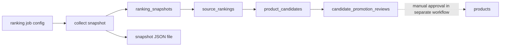

# Ranking Collection Pipeline

## Principles

The ranking pipeline separates source observations, manual promotion review, and the production catalog.

- A ranking snapshot is observation data.
- `source_rankings` stores individual observed ranking rows.
- `product_candidates` is the long-term candidate pool.
- `candidate_promotion_reviews` is a manual review queue derived from ranking evidence.
- `products` is the approved production catalog.
- The ranking pipeline does not modify `products`.

## Data Flow



## Ranking Job Config

Config file:

```txt
crawler/config/ranking-jobs.json
```

Phase 1/2 supports Hwahae ranking pages only. Other source names are not part of this implementation.

Required JSON fields:

- `id`
- `source`
- `source_category_key`
- `service_category`
- `source_product_form`
- `ranking_scope`
- `ranking_filter`
- `source_concern_key`
- `canonical_concerns`
- `evidence_type`
- `limit`
- `enabled`
- `disabled_reason`

`ranking_filter` identifies the source ranking filter, such as `all` or `acne`. It is not the same thing as product concerns and should not be promoted into product tags automatically. Concern context belongs in `source_concern_key` and `canonical_concerns`.

Enabled jobs are limited to verified Hwahae single-page JSON-LD category rankings. Top 50/100 pagination and concern-ranking jobs stay disabled until the actual URL, filter semantics, pagination, and JSON-LD structure are verified.

## Snapshot Storage

Local snapshot files are written under:

```txt
data/hwahae/ranking-snapshots/{serviceCategory}/{rankingScope}/{rankingFilter}/
```

The directory is ignored by git. Files contain:

- raw JSON-LD payload
- normalized ranking items
- collector version
- source URL
- `snapshotHash`

The database stores the same source payload in `ranking_snapshots.raw_payload` so later diff/report jobs can work without touching `products`.
It also stores collection-time context in `source_category_key`, `source_product_form`, `source_concern_key`, `canonical_concerns`, `evidence_type`, and `requested_limit` so historical analysis does not depend on the current config file.
`snapshotHash` is a content fingerprint for comparison and audit, not a unique identity. It excludes collection time. Identical payloads from different collection times are valid separate snapshots.
`ingestKey` is the retry identity for one locally generated snapshot. Re-running the same saved snapshot is idempotent only after the existing remote snapshot is already `ingested`: it reuses the existing snapshot, does not duplicate `source_rankings`, and does not increment candidate `seen_count` again. Reusing the same `ingestKey` with different snapshot metadata is a conflict. Reusing the same `ingestKey` for an existing non-`ingested` snapshot is blocked and requires investigation/recovery. A later collection with the same `snapshotHash` and a distinct `ingestKey` is a new snapshot.

## Candidate Identity

Phase 1 requires stable source identity on every ranking item:

```txt
source_name + external_type + external_id
```

Items without `external_type` and `external_id` fail closed before any remote write. Phase 1 does not use name/brand fallback identity, because fallback normalization can drift between crawler code and SQL.

Allowed Phase 1 `serviceCategory` values are `cleanser`, `toner_essence`, `toner_pad`, `treatment`, `moisturizer`, `moisturizer_lotion_emulsion`, `moisturizer_gel`, `moisturizer_cream`, `moisturizer_balm`, and `sunscreen`. Legacy `serum`, `ampoule`, and `essence` are rejected for ranking ingestion.

Within one snapshot, the ingest RPC rejects duplicate rank positions and duplicate candidate identities before writing. `source_rankings` also enforces uniqueness by `snapshot_id + rank_position` and by `snapshot_id + candidate_id` when `candidate_id` is present.

## Atomic Ingest Boundary

The only Phase 1 remote write path is `public.ingest_ranking_snapshot(text, jsonb)`, called with the local snapshot `ingestKey` and payload by the service-role crawler.

The RPC runs as one transaction:

- create or reuse the `ranking_snapshots` row for the `ingestKey`
- validate all ranking items before candidate mutation
- create/update observational `product_candidates`
- insert `source_rankings`
- mark the snapshot `ingested` only after full success

If validation or insertion fails, no remote snapshot, source ranking, or candidate mutation from that failed RPC persists.

Dry-run mode still fetches Hwahae and writes local snapshot JSON files, but it does not call the RPC and does not create remote Supabase rows.

Candidate creation is conflict-safe on `source_name + external_type + external_id`, so concurrent snapshots observing the same new product reuse the same candidate instead of failing on the external identity unique index.
`service_role` is the only intended DB writer for Phase 1 ranking ingestion. The migration grants only the table privileges needed for the security-invoker RPC and does not add public read policies or anon/authenticated write grants.

## Post-Apply Verification SQL

After applying the migration to a staging project, verify the access model and initial state before crawler writes:

```sql
select relname, relrowsecurity
from pg_class
where oid = 'public.ranking_snapshots'::regclass;

select
  p.proname,
  pg_get_function_identity_arguments(p.oid) as args,
  p.prosecdef,
  p.proacl::text as acl
from pg_proc p
join pg_namespace n on n.oid = p.pronamespace
where n.nspname = 'public'
  and p.proname = 'ingest_ranking_snapshot';

select
  has_function_privilege('anon', 'public.ingest_ranking_snapshot(text,jsonb)', 'EXECUTE') as anon_can_execute,
  has_function_privilege('authenticated', 'public.ingest_ranking_snapshot(text,jsonb)', 'EXECUTE') as authenticated_can_execute,
  has_function_privilege('service_role', 'public.ingest_ranking_snapshot(text,jsonb)', 'EXECUTE') as service_role_can_execute;

select indexname, indexdef
from pg_indexes
where schemaname = 'public'
  and tablename in ('ranking_snapshots', 'source_rankings', 'product_candidates')
  and indexname in (
    'ranking_snapshots_ingest_key_key',
    'source_rankings_snapshot_rank_position_key',
    'source_rankings_snapshot_candidate_id_key',
    'product_candidates_source_external_key'
  );

select count(*) as ranking_snapshots_count
from public.ranking_snapshots;

select count(*) as source_rankings_count
from public.source_rankings
where snapshot_id is not null;

select count(*) as candidate_observations_count
from public.product_candidates
where external_id is not null;
```

## Review Queue

After a full successful unfiltered crawl, the crawler calls `public.refresh_candidate_promotion_reviews(text)` with `ranking-review-v2`.

The refresh RPC:

- summarizes concern and popularity ranking evidence
- inserts one review row per candidate at most
- updates only `queued` and `reviewing` rows
- never moves `approved`, `rejected`, or `deferred` rows back to queued
- excludes candidates already present in `products` by normalized brand/name
- excludes candidates without external identity
- returns `products_written = 0`

`ranking-review-v2` queue criteria are conservative and use KST distinct observed dates:

- `top_15_immediate`: latest concern rank is 15 or better
- `rank_16_30_persistent`: latest concern rank is 16 to 30 and the same canonical concern has at least two KST distinct observed dates
- `rank_31_50_reinforced`: latest concern rank is 31 to 50, the same canonical concern has at least three KST distinct observed dates, and either latest popularity rank is 30 or better or the candidate appears across at least two distinct canonical concerns

Popularity evidence alone never queues a candidate. Same-day repeated crawls do not satisfy persistence, and concern rank 51 or worse is excluded by this policy. Candidates that no longer qualify are moved out of the active `queued`/`reviewing` queue on the next refresh, while `approved`, `rejected`, and `deferred` rows are not moved back to queued automatically.

Use:

```bash
cd crawler
npm run reviews:pending
```

to list queued/reviewing candidates and their evidence summary.

## Products Boundary

Forbidden actions:

- direct `products` insert
- direct `products` update
- direct `products` delete
- promotion RPC changes
- automatic candidate promotion
- automatic product tag finalization

The existing `promote:approved` and `enrich:products` commands are not part of ranking collection and can modify `products`; run them only in a separate approved promotion workflow.
